## Лабораторна робота №1
### 1. Створення документації на основі MarkDown
Код:

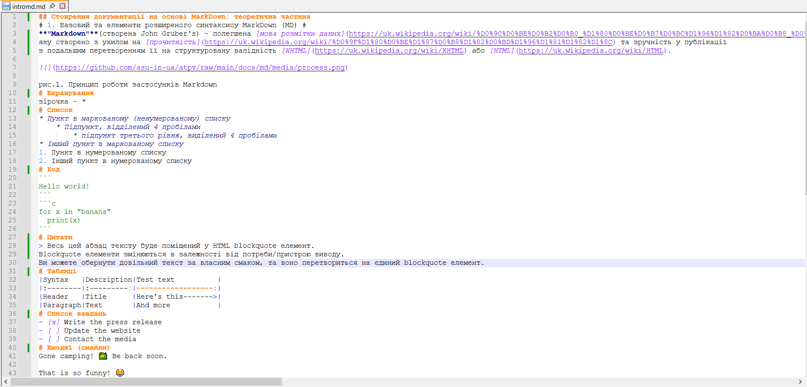

Результат:

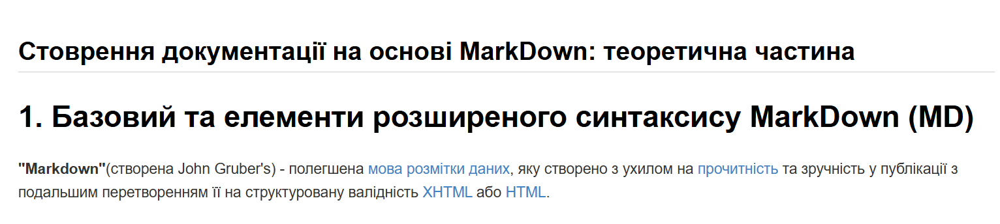

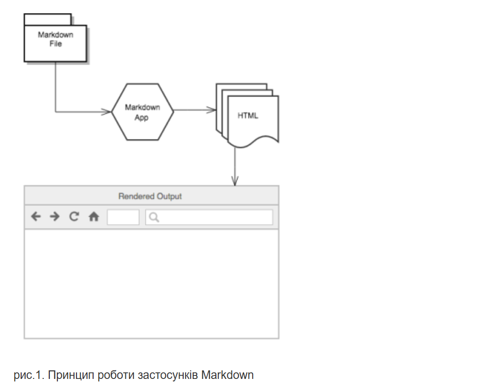

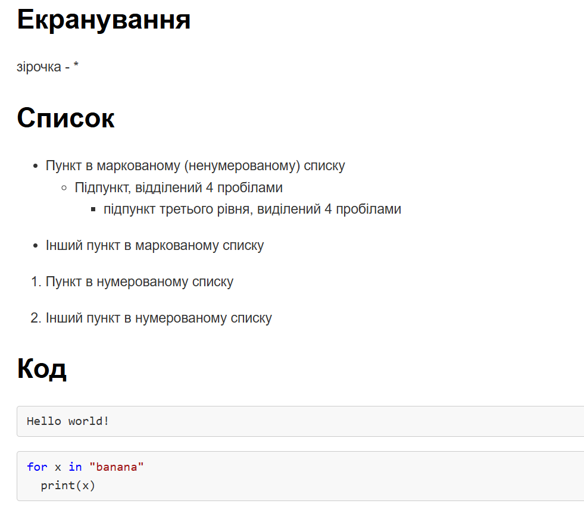

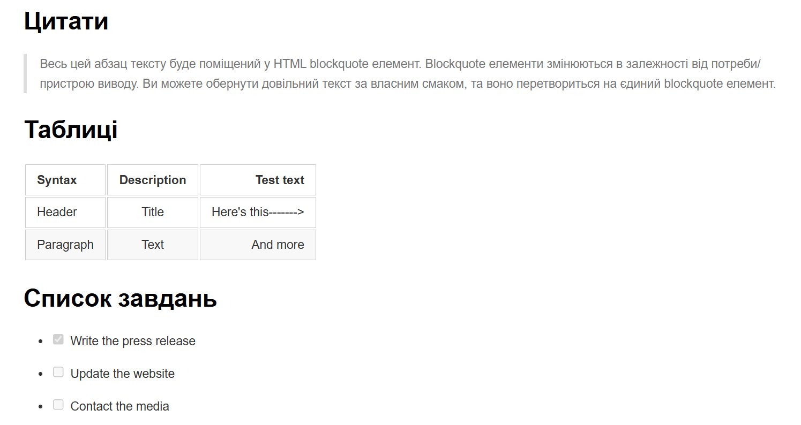

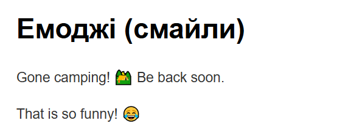

Код:

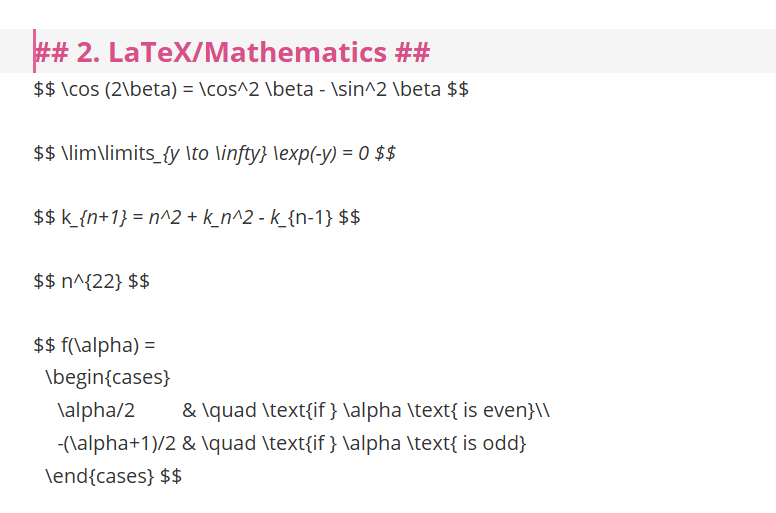

Результат:

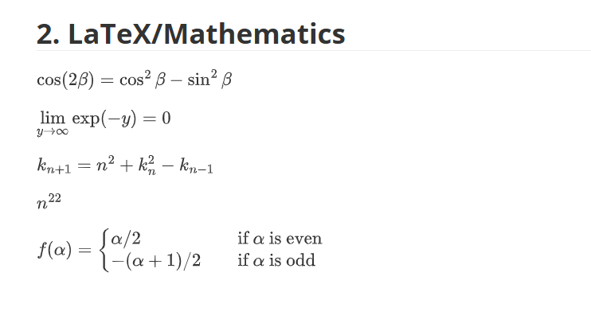

Код і результат:

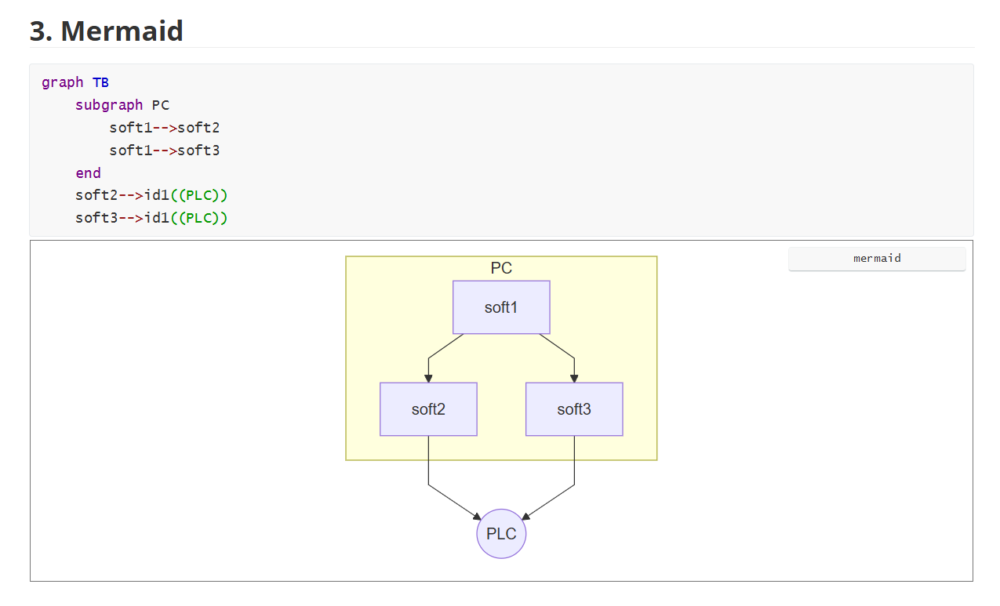

### 2. Робота в GitHub

Коментар:

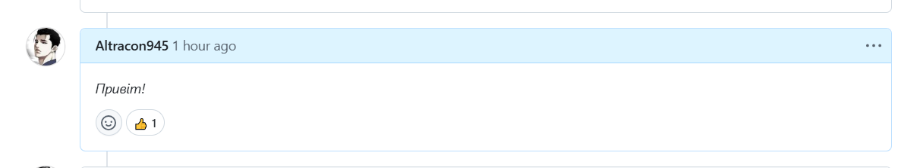

Профіль:

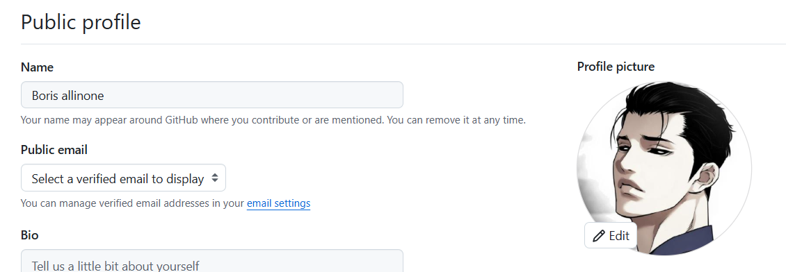

Репозиторій:

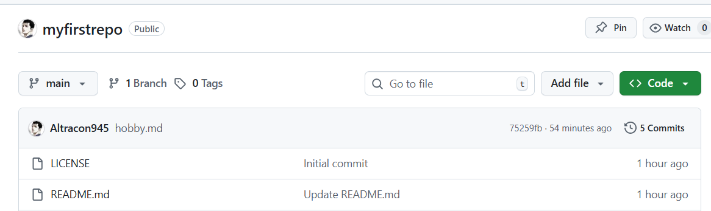

hobby.md(код):

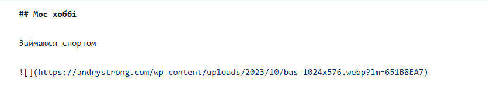

hobby.md(результат):

Додавання зображення:

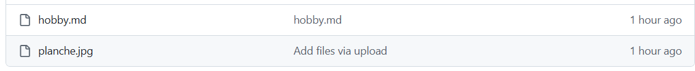

Вставлення посилання на зображення в код:

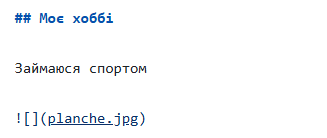

Змінене зображення:

Додавання теми для сайту:

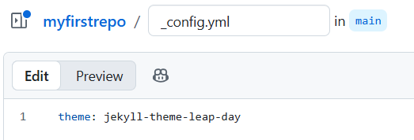

Посилання на мій сайт:

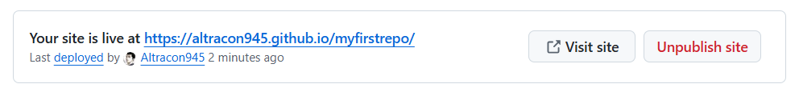

Workflow:

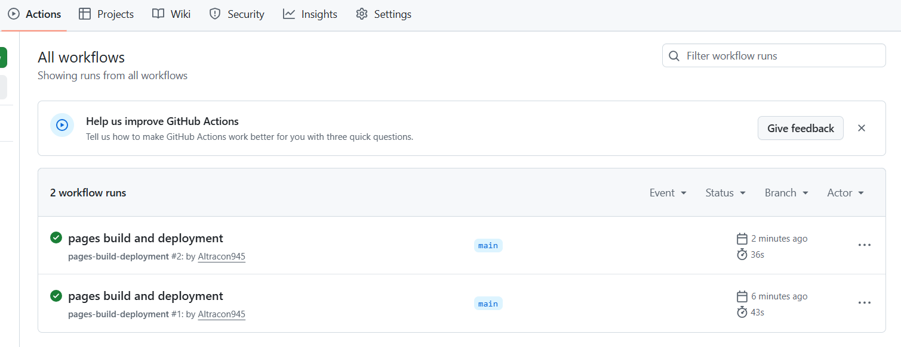

Додавання до сайту стрічки про хоббі:

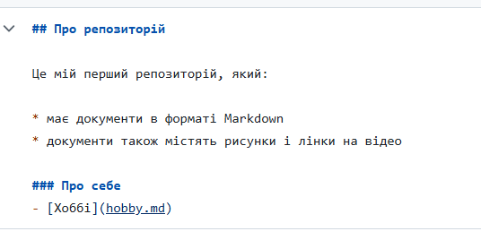

Завантаження цієї стрічки:

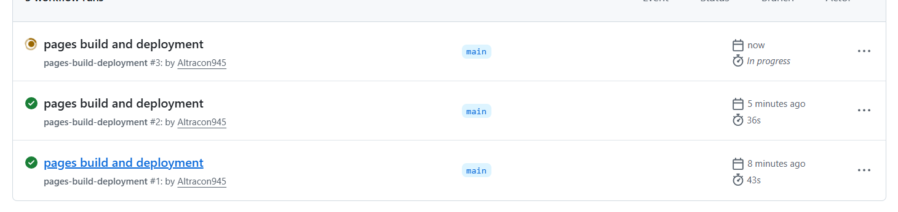

Мій сайт(оновлений):

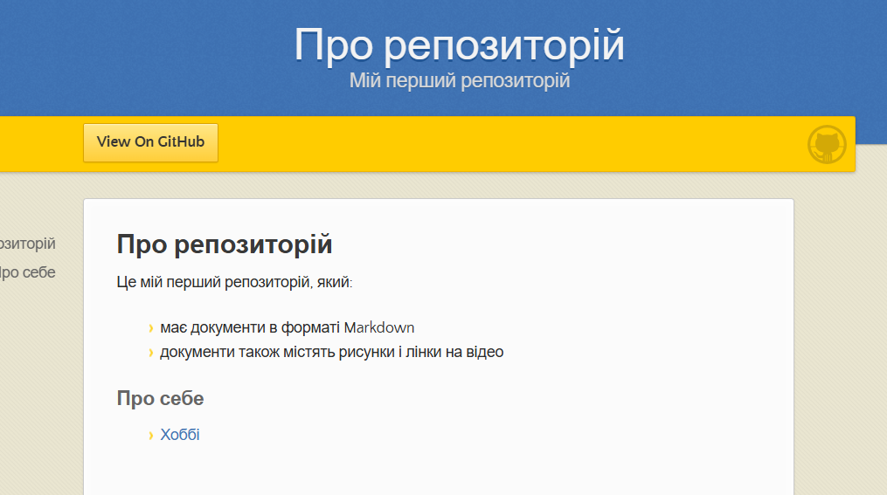

Створення приватного репозиторію:

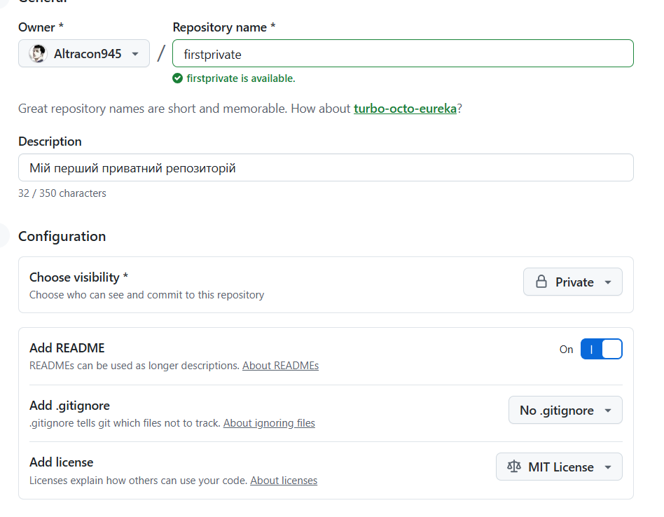

Додавання іншого користувача до мого приватного репозиторію:

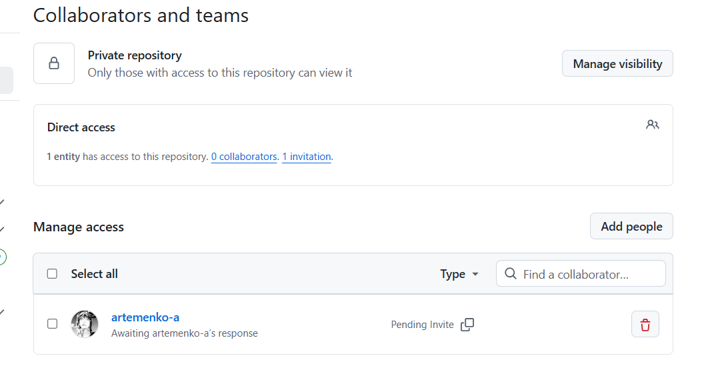
