# Звіт для Лабораторної роботи №11
## Основи SQL: практична частина
Це я тільки запустив `HeidiSQL`

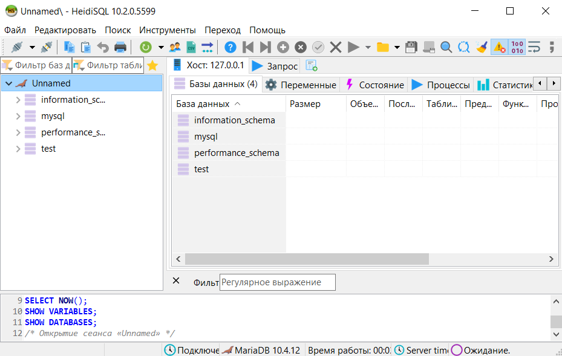

Тут я вже створив нову БД, а також таблицю в ній. А далі я її заповнював, додавав нове поле `Timestamp` яке виводило поточний час, а також створив індексне поле. 

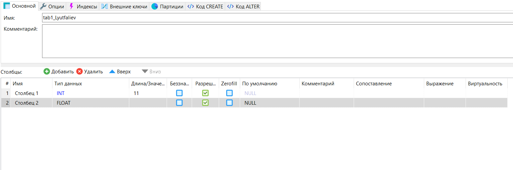

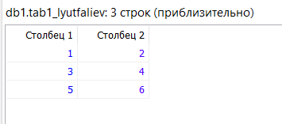
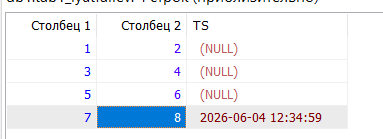

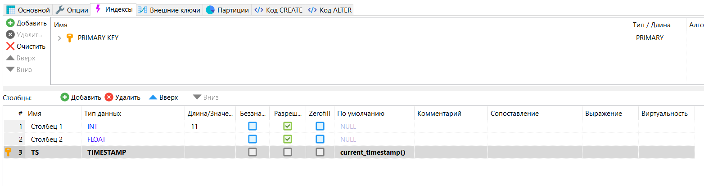

Тут я створював БД, таблицю та полі таблиці за допомогою запита SQL. Також я створив кілька записів за допомогою SQL, і потім промодифікував її.

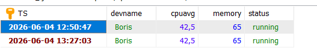
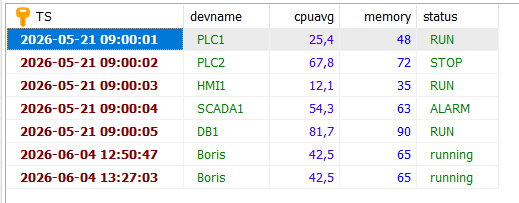
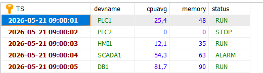

Далі я почав використовувати `SELECT` для вибірки даних, а також робити агрегацію, групування та псевдоніми.

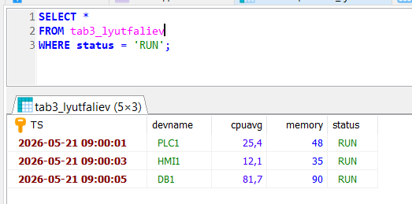
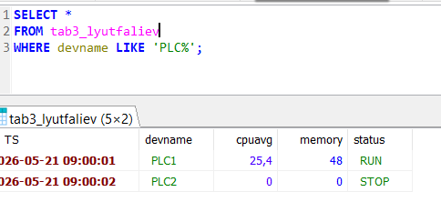
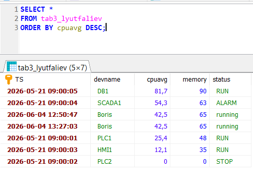
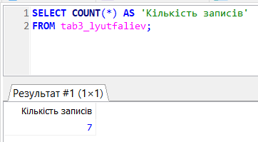
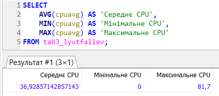
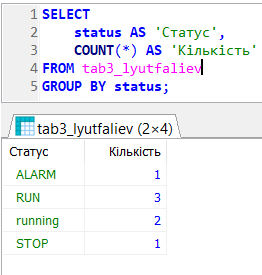
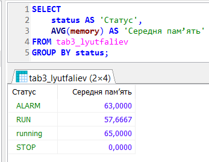
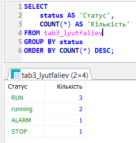

Тут я модифікував структуру таблиці.

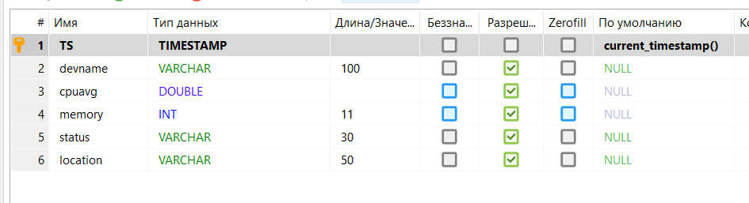

Далі я почав видаляти записи, очищати таблицю та зрештою видалив таблицю.

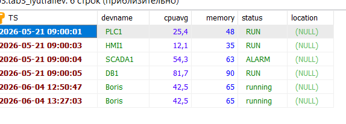
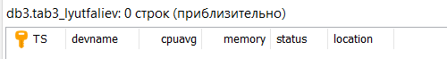
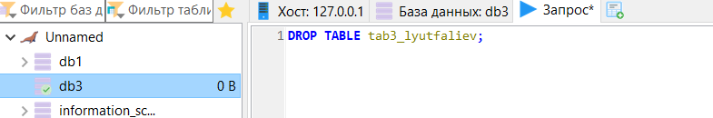

Потім я повністю видалив БД, які я створив.

## Робота з SQL в Node-RED: практична частина
Тут я встановив та перевіряв бібліотеку Node-RED для роботи з БД.

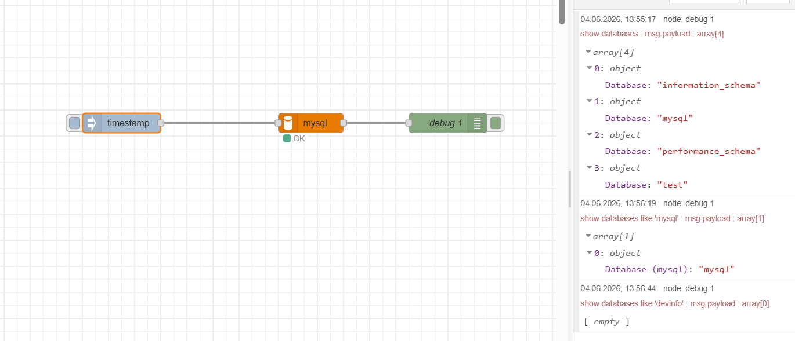

Далі я створив запит на створення бази даних. 

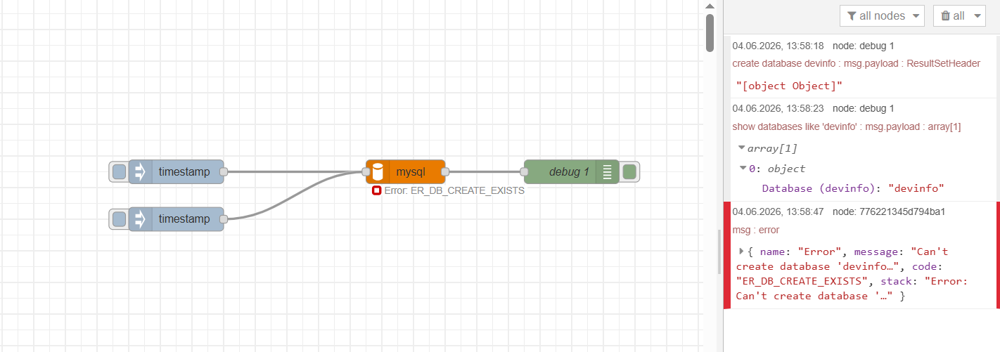

Далі я створив фрагменту коду, що створює базу даних з необхідними таблицями при старті

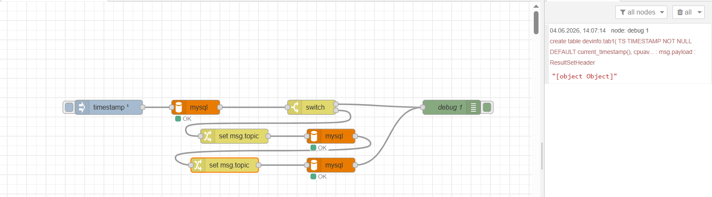
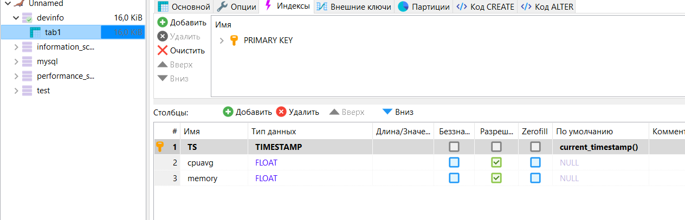

Тут я створив фрагмент програми ресурсів, попередньо завантаживши та перевіривши роботу вузлів `Memory` та `CPUs`.

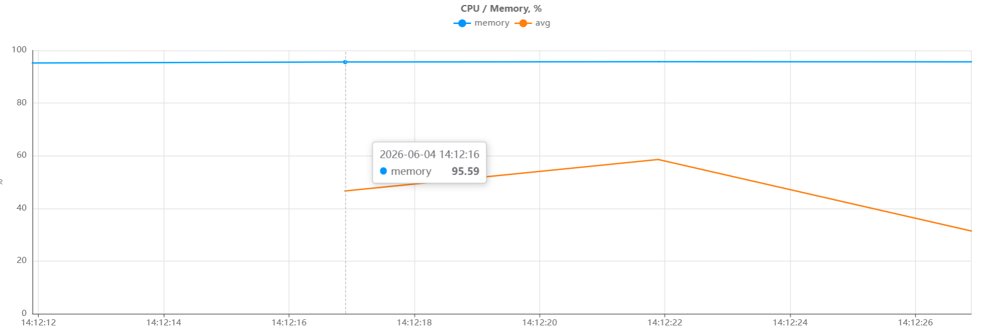

Тут я модифікував програму для формування записів в історію. А також, потім, я реалізував запит вибірки.

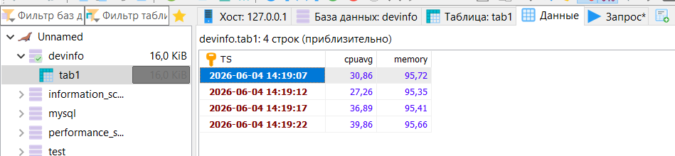

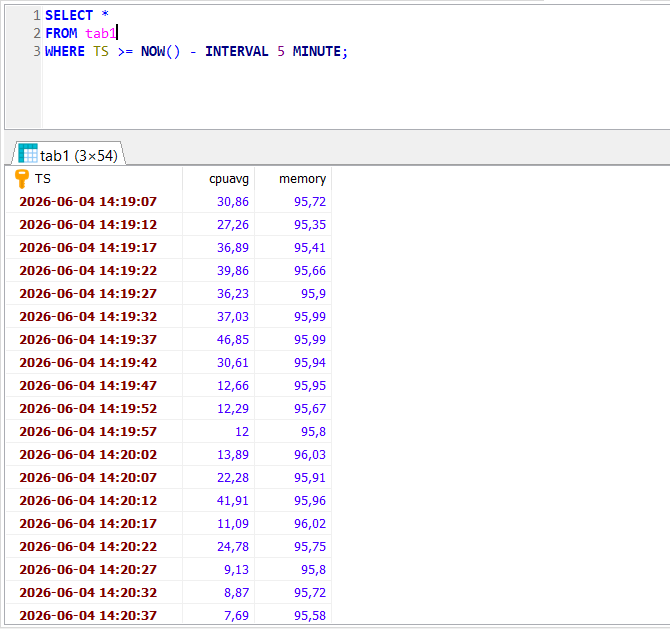