# Звіт для Лабораторної роботи 12
## 1. Інтегрування Node-RED з застосунком Google Sheet
Створення сервісного аккаунту.

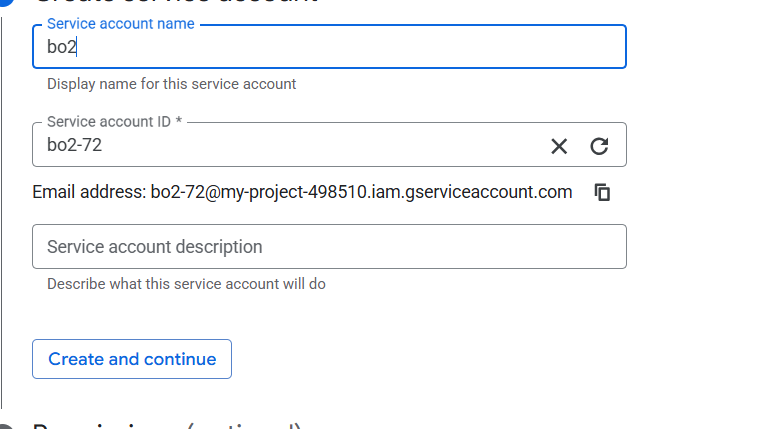

Це я відкрив перелік сервісних аккаунтів.

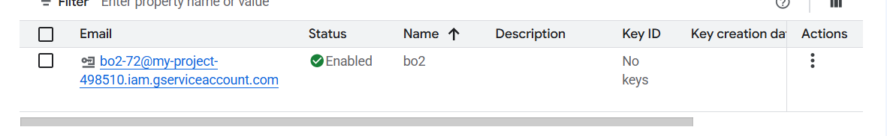

Це налаштування мого сервіного аккаунту.

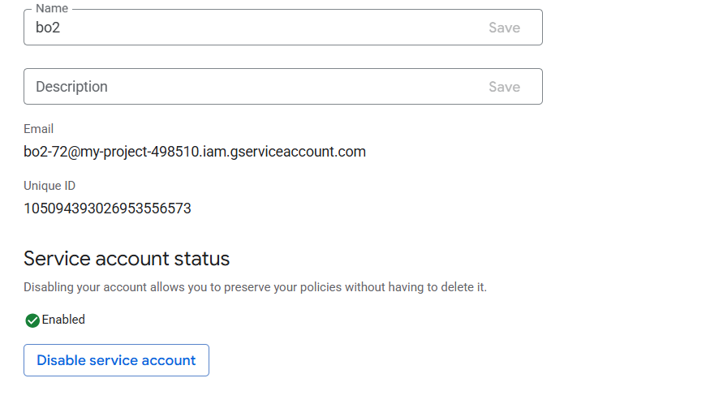

Тут я створив фрагмент запису в електронну таблицю значень буферу.

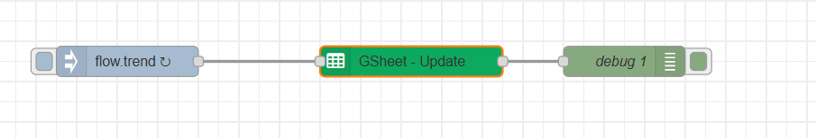

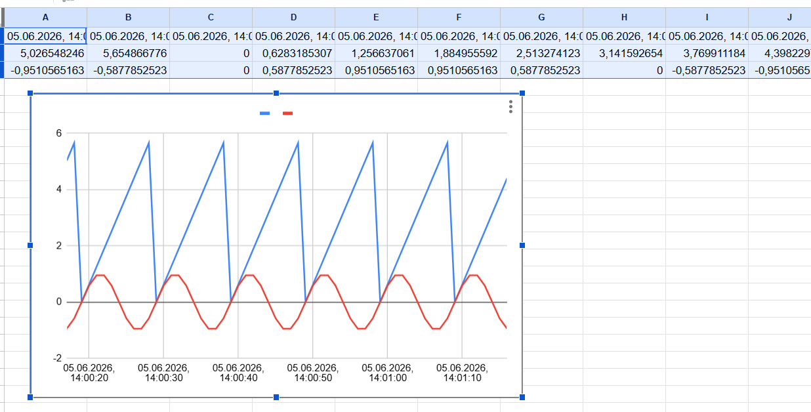
## 2. Створення Телеграм-бота в Node-RED
Це все поступово створенний Телеграм-бот. Де я додавав комманди та через вузол `inject` робив так, щоб бот надсилав текстове повідомлення.

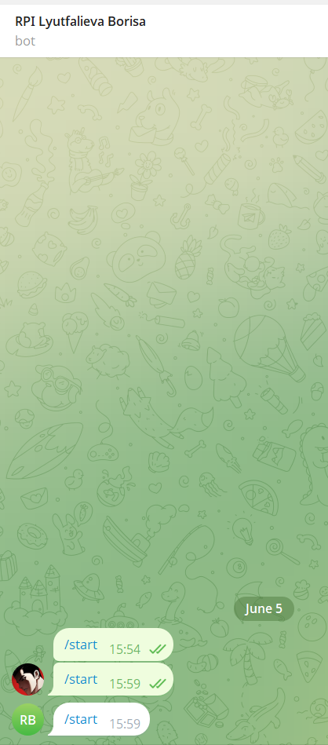
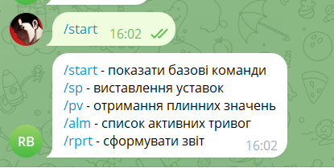

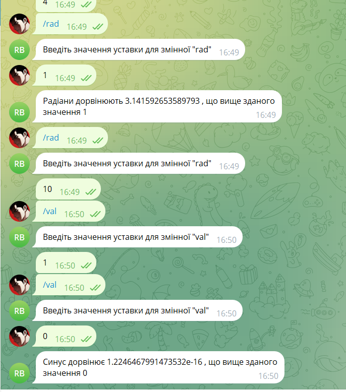
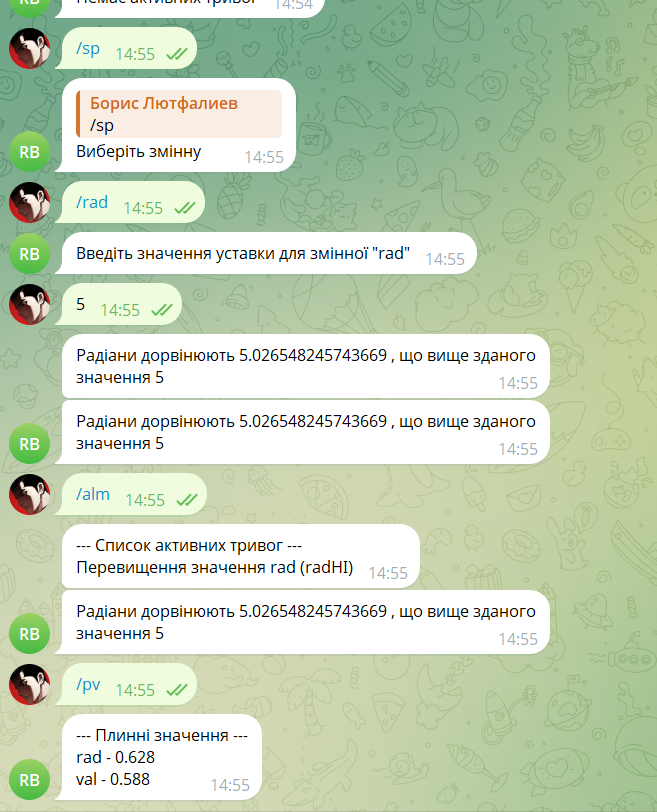

Це весь код за допомогою якого цей бот функціонує.

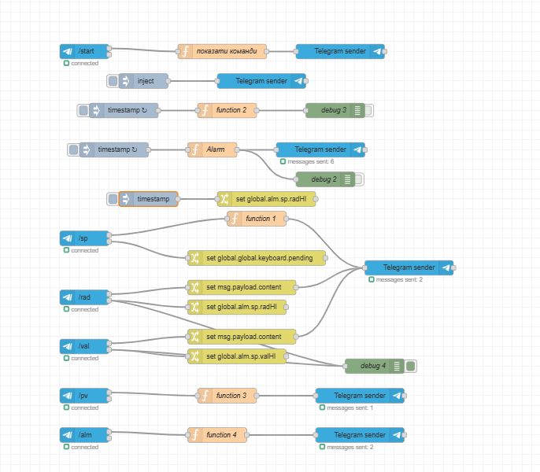

Тут я перевіряв на іншому аккаунті свого бота.

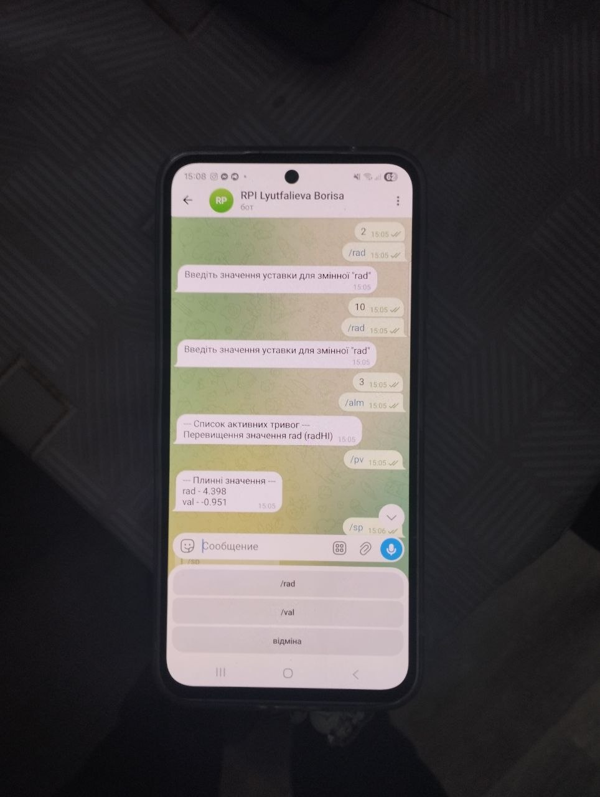