## Лабораторна робота №2
### Робота в Git
Створення файлу в робочій папці:
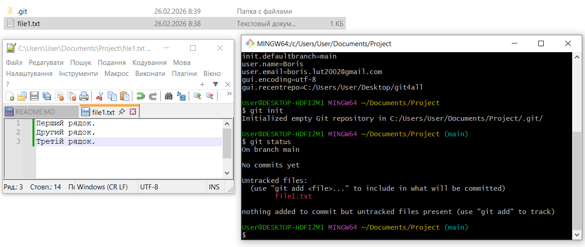
Перегляд змін у файлі в Git GUI:
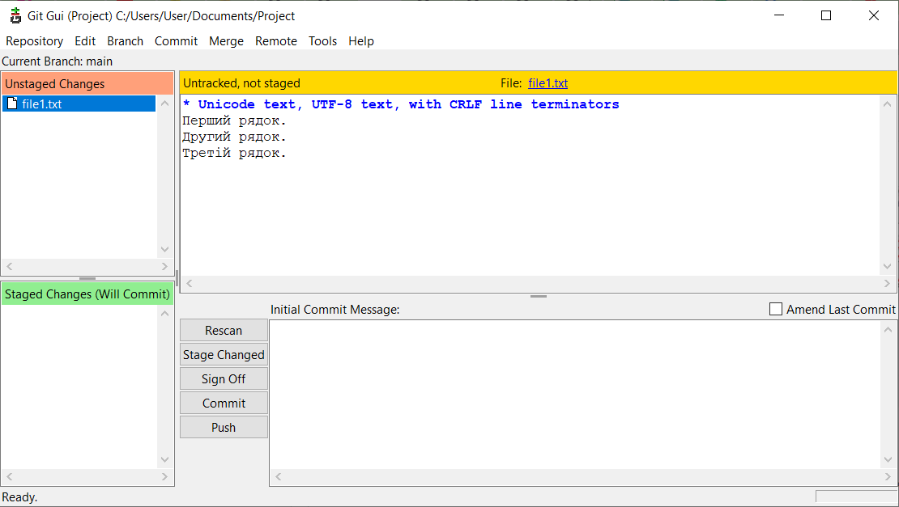
Виведення стану репозиторія через команду "git status":
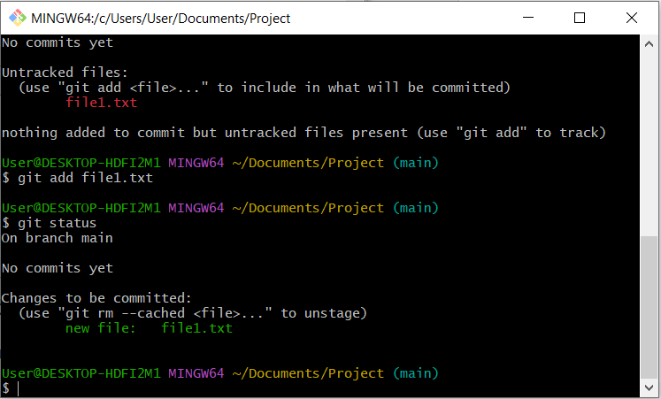
Перегляд історії проєкту:
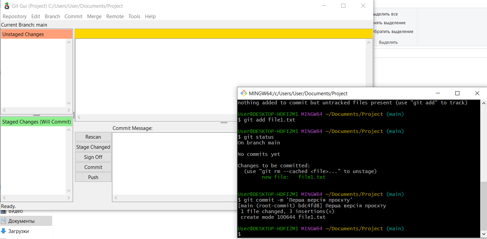
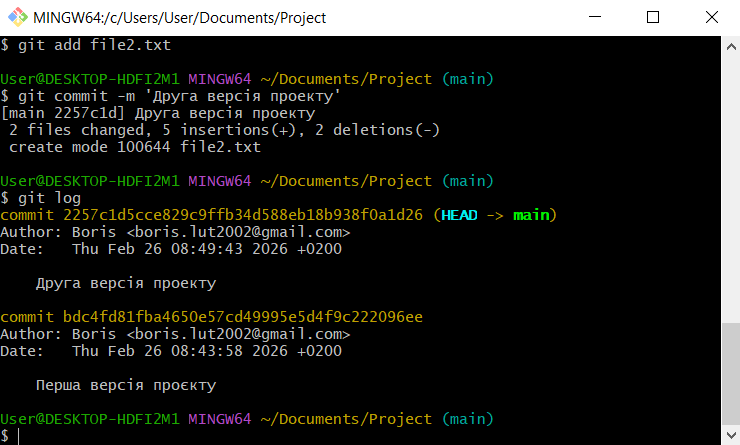
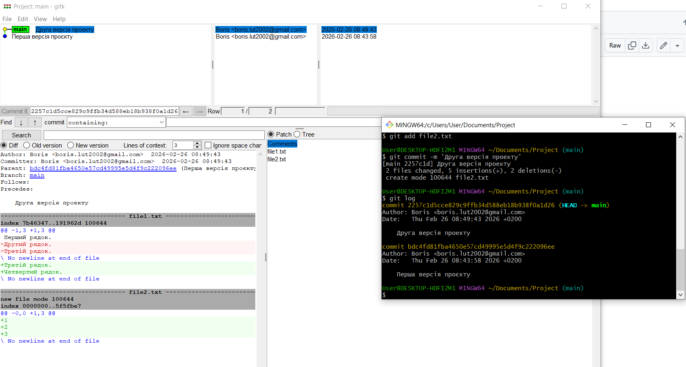
### Від локального Git до Github
Результат виконання програми Fetch from -> origin:
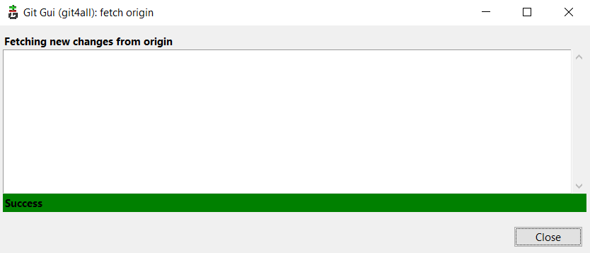
Результат отримання змін через fetch у власний репозиторій:
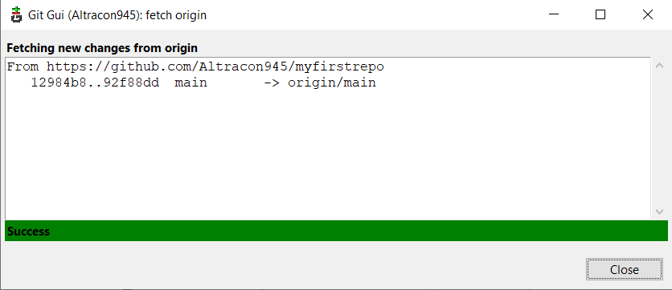
Результат злиття віддаленої та локальної гілки:
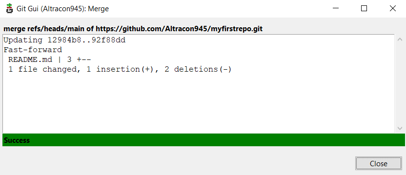
Історія комітів:
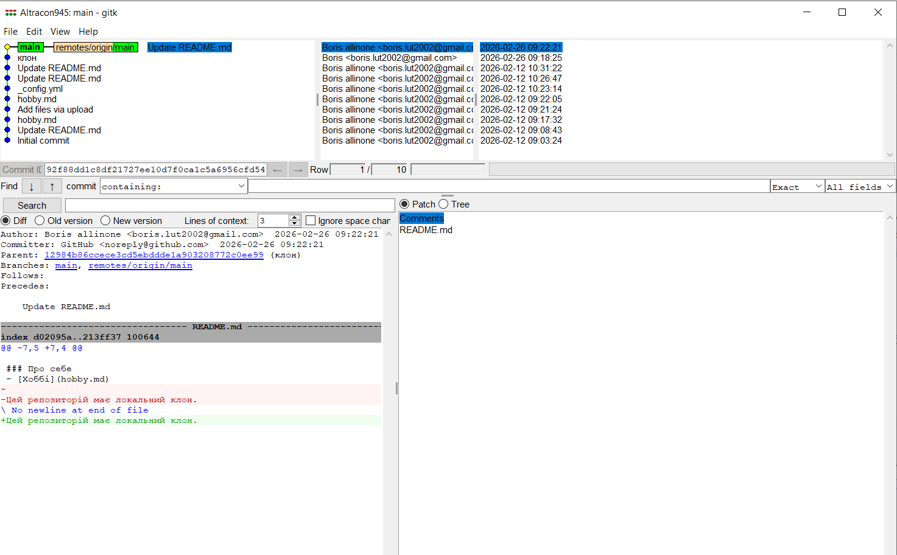
Створення конфлікту:
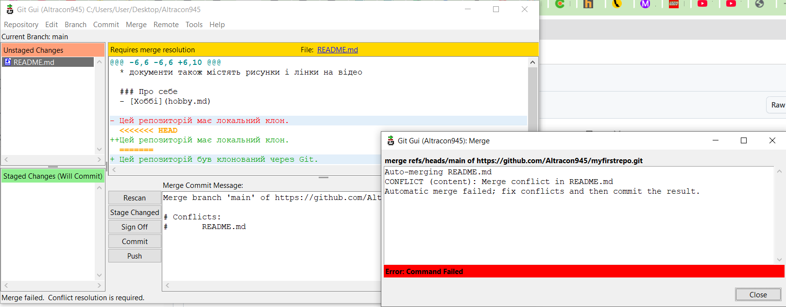
Аналіз конфлікту:
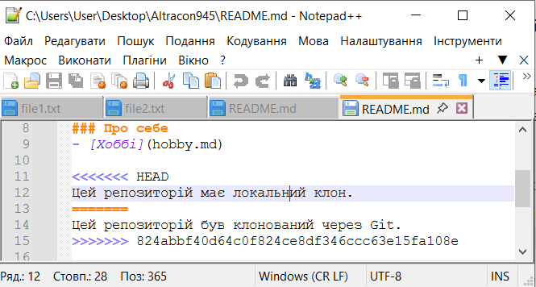
Подолання конфлікту:
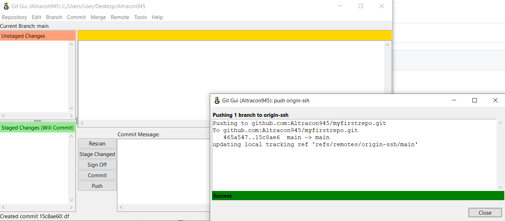