## Звіт для лабораторної роботи №4

Це я встановив палітру

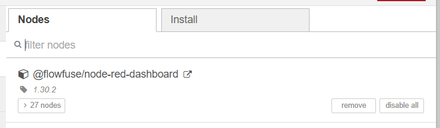

Тут я розмістив вузли inject та gauge, і змінив налаштування inject так, щоб він кожні в 2 секунди формував у msg.payload випадкове значення в діапазоні 0-10.

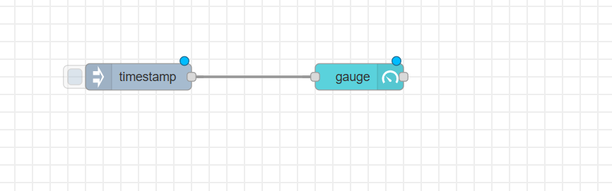
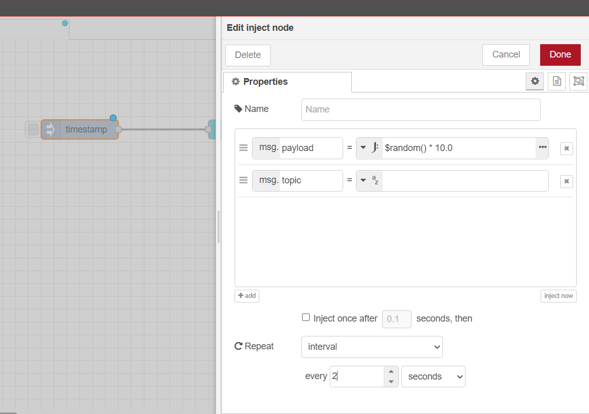

Перейшовши у Dashboard, я побачив індикатор який відображав значення у неформатованому вигляді.

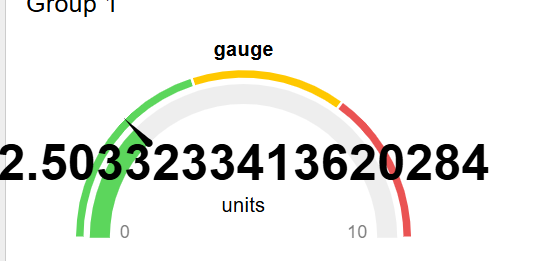

Далі у налаштуваннях gauge я зробив так, щоб після коми було тільки одне число, щоб він мав 4 кольори, і щоб замість "units" було "m/s" і назва була "speed".

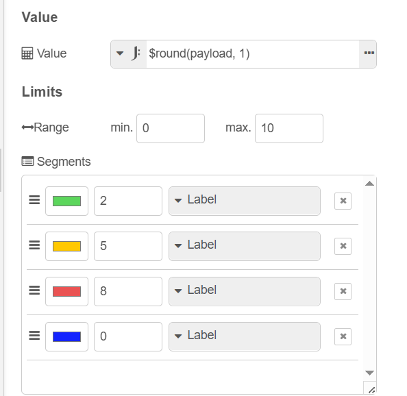
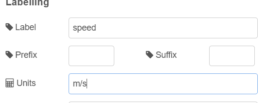
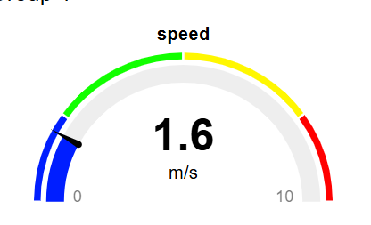

Тут я змінив кольорову гаму.

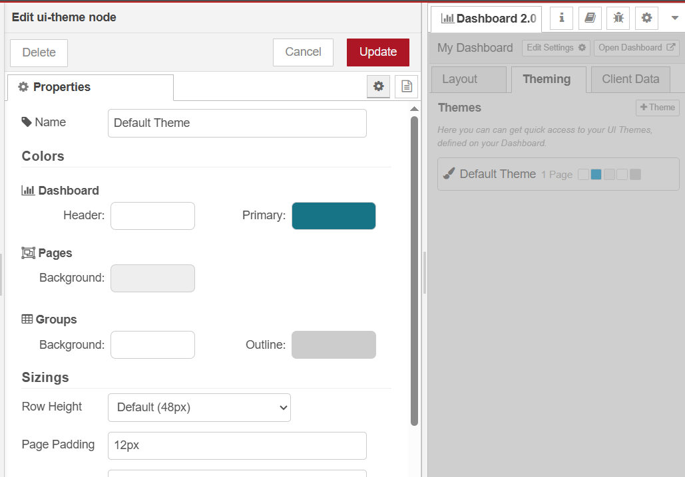

Далі я скопіював віджет speed 2 рази і модифікував його.

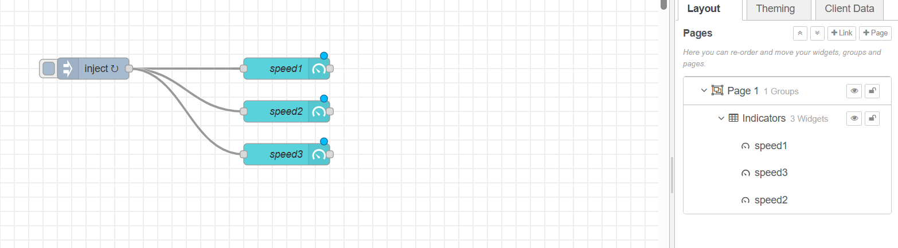
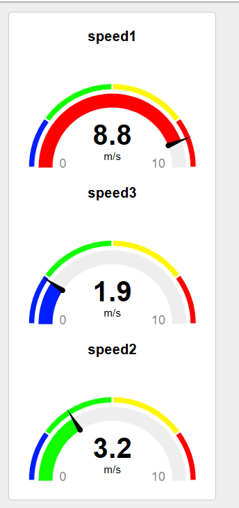

Тут я налаштовував розміри груп і віджетів так, щоб вони були в одному рядку.

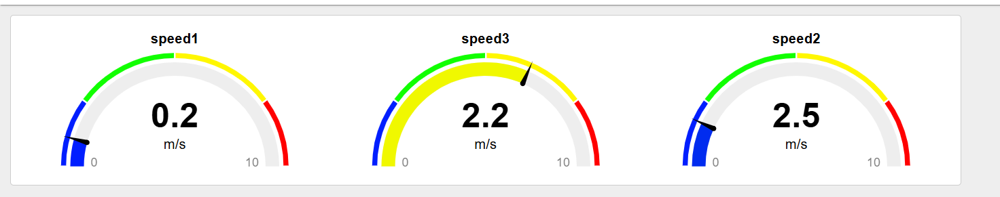

А тут я налаштував різні відображення "speed".

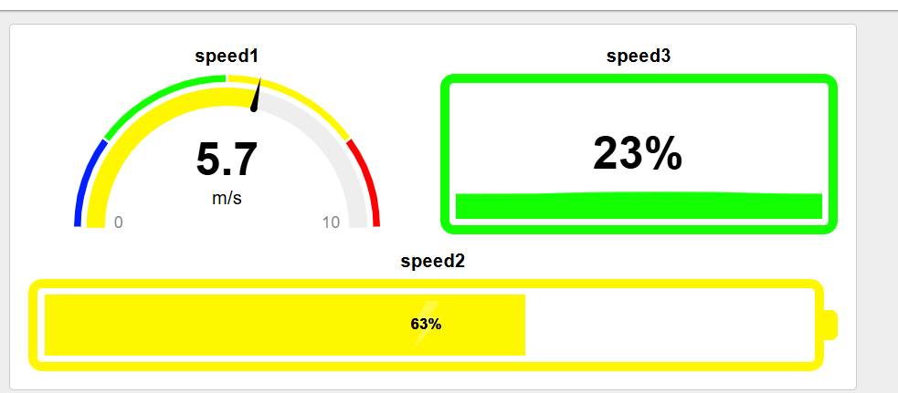

Тут я скопіював та імпортував новий віджет. 

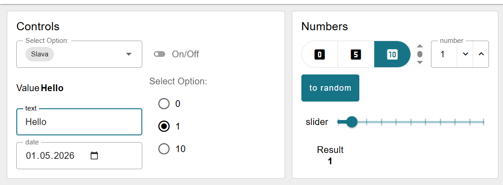

Далі я його налаштовував, щоб число змінювалось при керуванні повзунком, щоб у вікні з числом відображався колір, та додав у віджет "select options" нове значення.

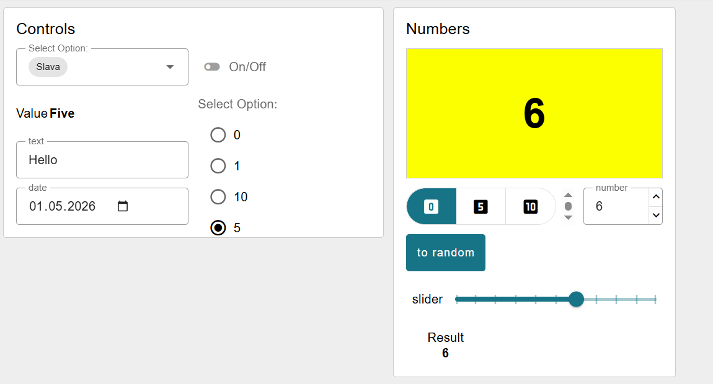

І в цій таблиці, я додав нову колонку "num" і зробив так, щоб у цій колонці відображалося значення поля прогрес у вигляді числа.

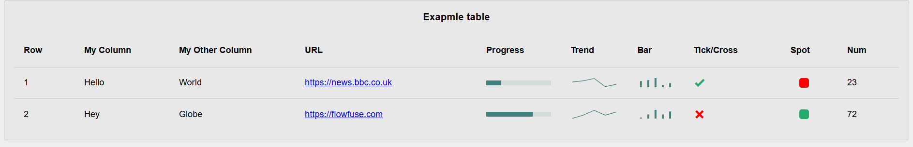