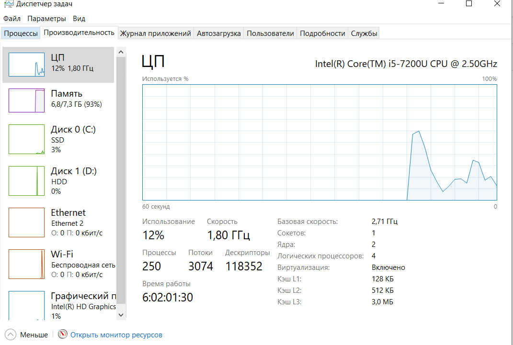
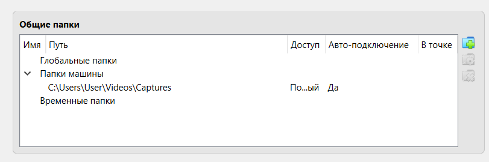
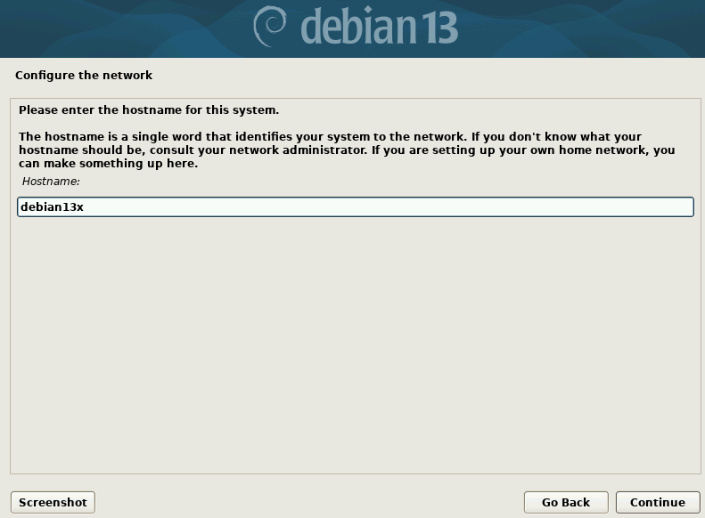
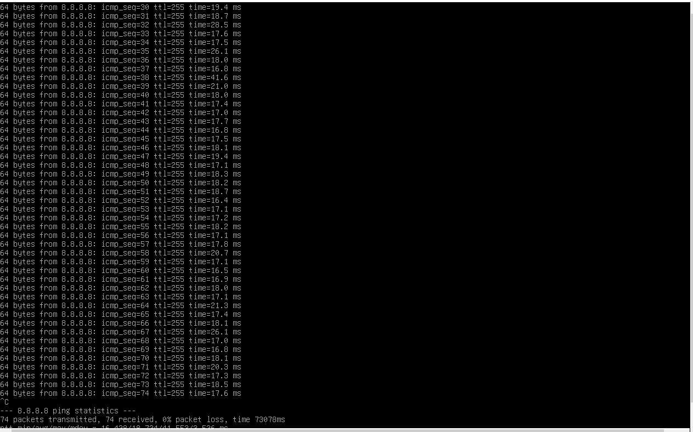

# Звіт для Лабораторної роботи 6

Почнемо з першої частини лабораторної роботи.

В цьому кроці я активував віртуалізацію у вкладці "продуктивність".

Тут я вже встановив "WindowsXP", бо в мене не вистачало характеристик для "Windows10"

Тут я створив спільну папку і додав її до WindowsXP.

Далі переходимо до другої частини лабораторної роботи, а саме до встановлення та налаштування "Debian13".

В цьому кроці я встановлював та налаштовував Debian13, створював хостнейм, пароль, обирав мову на якій буде ця ОС, і т. д.

Тут я перевіряв та запускав Debian13, щоб перевірити чи все працює так, як слід.

Тут я отримував доступ до Debian13 через PuTTY. Це було зроблено для того, щоб PuTTY давав можливість працювати в командному режимі з Windows.

І останній крок це отримання доступу через WinSCP. Це я зробив для того, щоб можна було отримувати та записувати файли через табличне представлення.

