# Звіт для Лабораторної роботи №7
## Частина 1. Docker
Тут я встановлював Docker. Спочатку я оновив список пакетів ОСю Потім після встановлення службових пакетів, я додав офіційний репозиторій Docker до системи керування пакетами Debian. А далі я перевірив, чи встановлений в мене Docker, і чи що він запущений. 

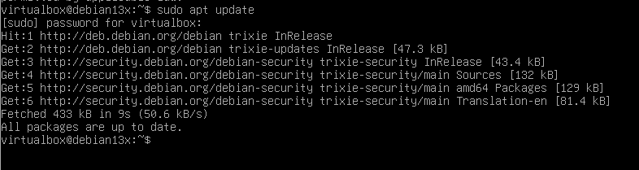
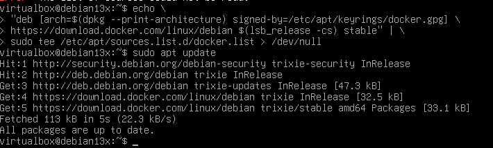
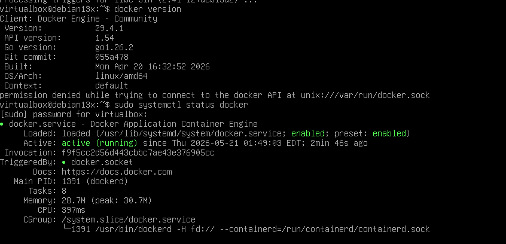

Тут я завантажував образ та запускав контейнер MariaDB.

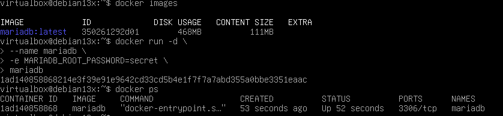

Далі я підключався до MariaDB та перевіряв роботу БД.

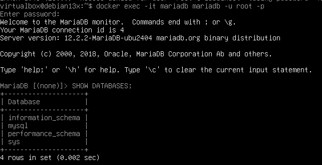
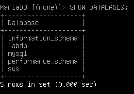

Тут я вже почав працювати з контейнером.

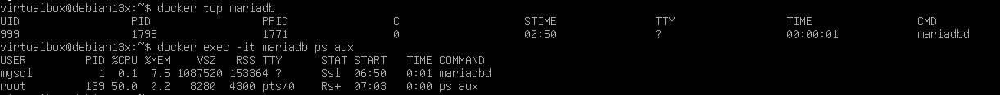

Тут я ознайомився з Docker volume.

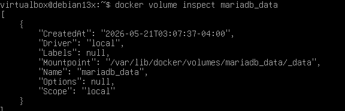

Тут я підключався до MariaDB з окремого контейнера.

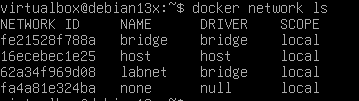
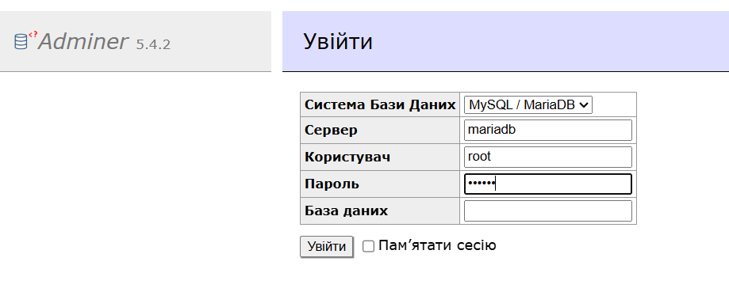
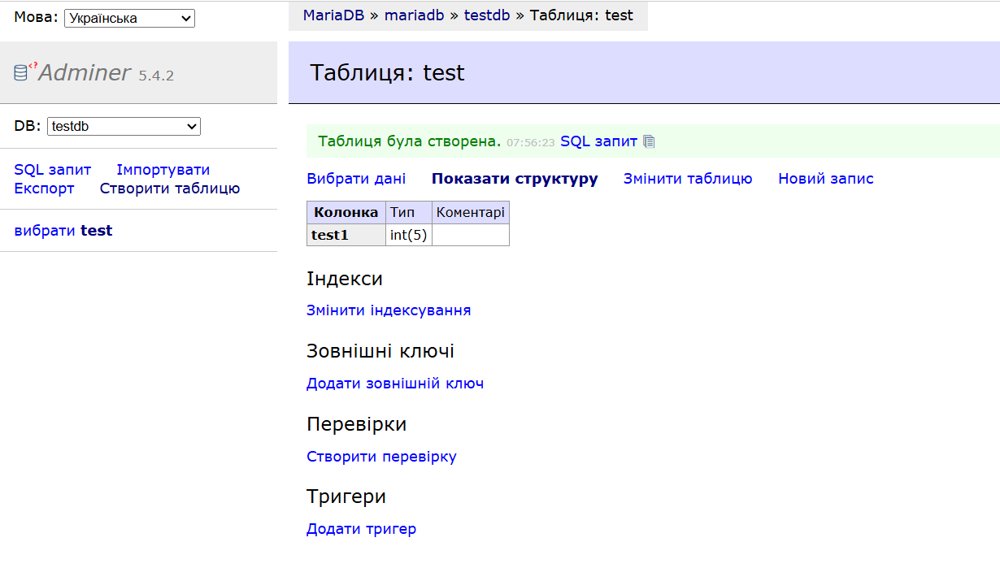
## Частина 2. Docker Compose
Тут я запускав середовища за допомогою Docker Compose.

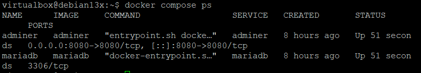
## Частина 3. Portainer
Тут я розгортав Portainer для керування Docker-середовищем.

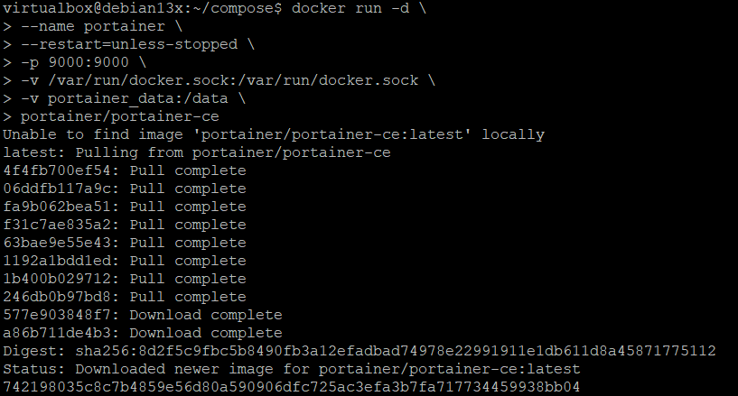
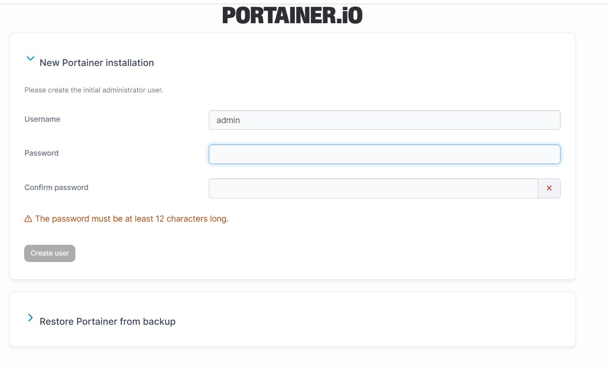

Тут я почав працювати у Portainer.

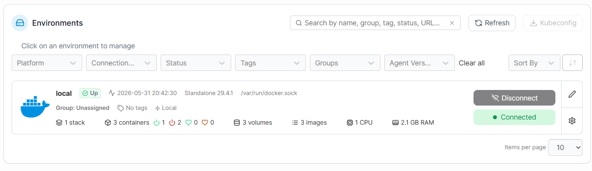
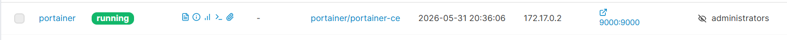