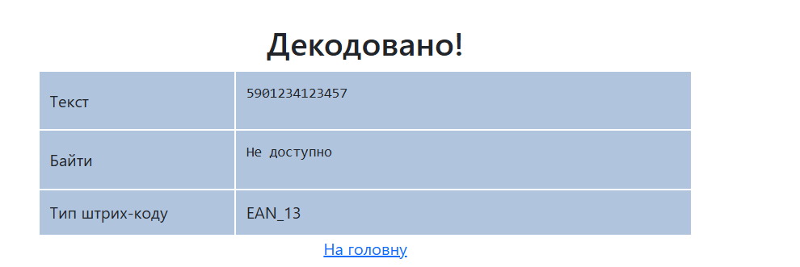
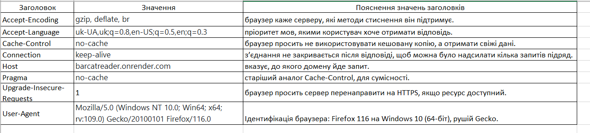
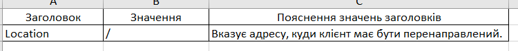
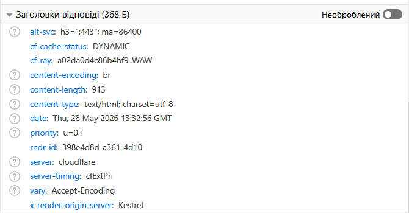
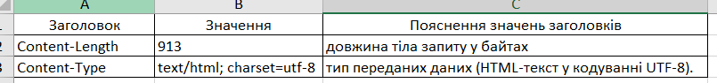
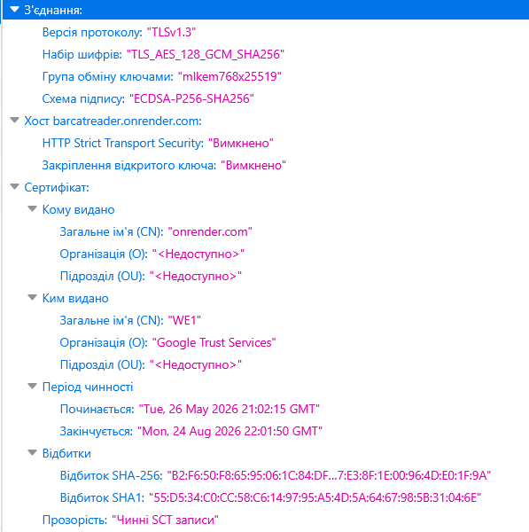
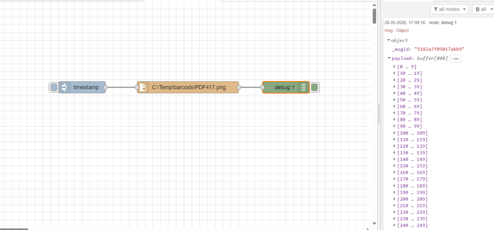
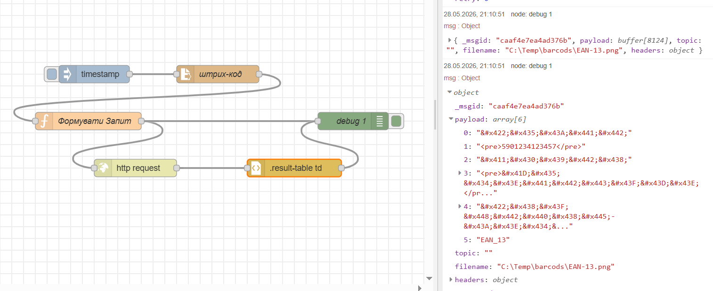
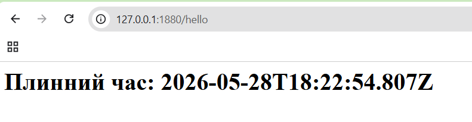

# Звіт для Лабораторної роботи №8
## Протокол HTTP: практична частина
Тут я перевірив роботу ВЕБ-застосунку BarCat Reader.

Тут я проаналізував заголовки 1-го мережного запиту та відповіді.

Тут я проаналізував заголовки та зміст POST

Відповідь на POST

## Робота з HTTP в Node-RED: практичне заняття
Це я зробив "читання файлу"

Тут я розбирав запит по частинам

Тут я вперше працював з `http-in`, `http-response` та `template`

