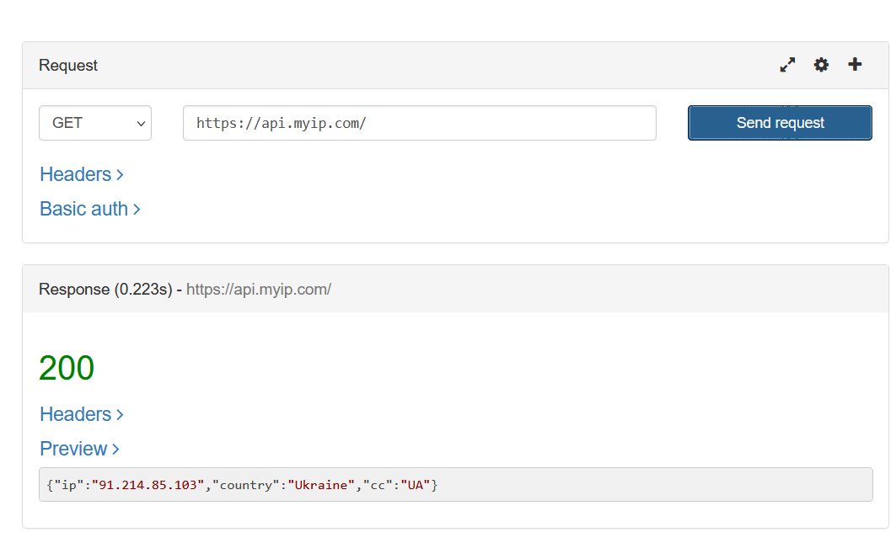
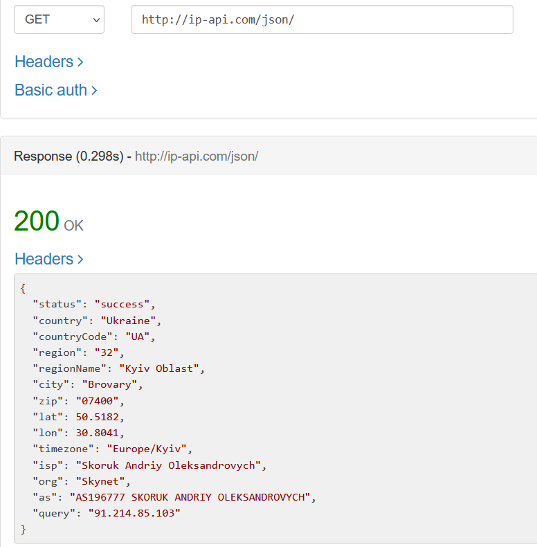
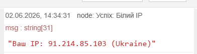
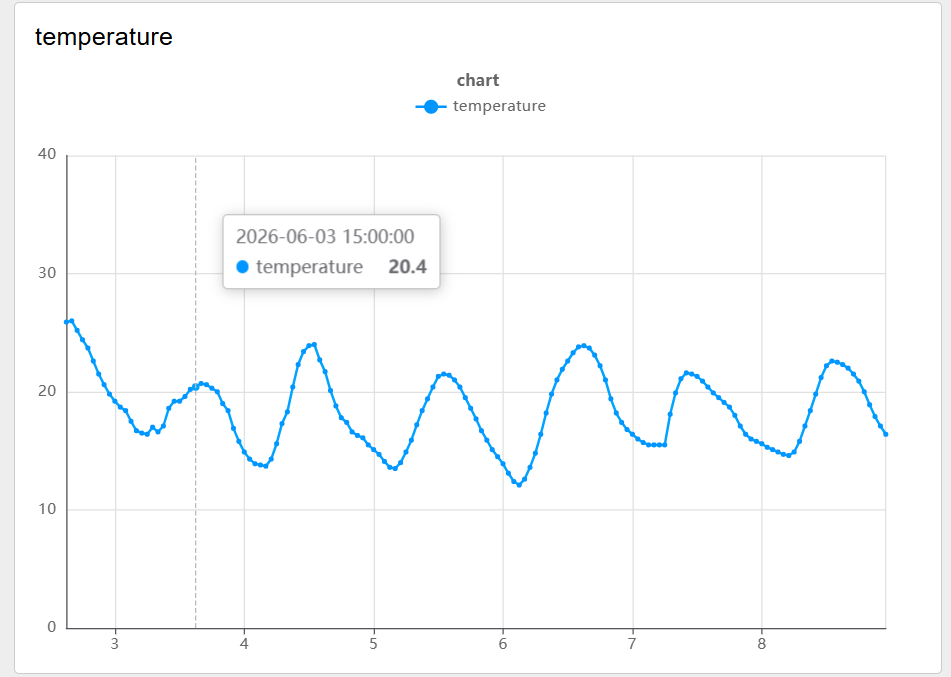
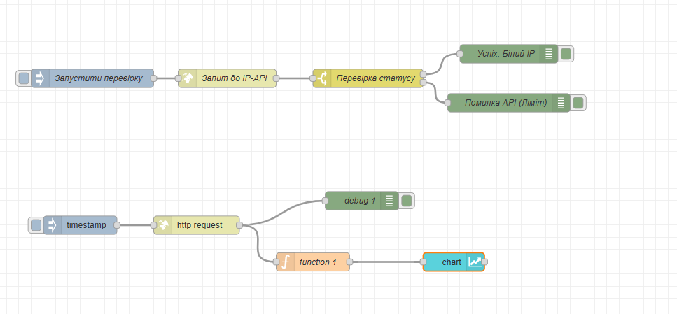

# Звіт для Лабораторної роботи №9
## Використання HTTP API: практична частина
Тут я працював з утилітами для API-тестування. Перевірив `білий ІР` та адресу `https://api.myip.com`.

Далі я створив клієнт для IPAPI в Node-RED.

Тут я вивів прогнозні дані по температурі та опадам у своєму місті.

# Код в Node-RED для реалізації самостійних пунктів
